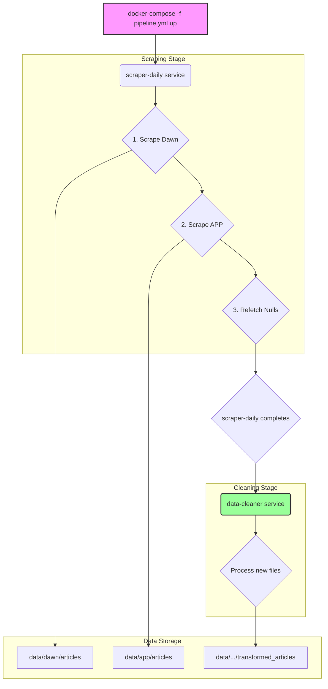

# Developer Notes

This document provides practical guidance for working on the XAI Articles Scraper project. It covers the Docker-based setup, coding conventions, script usage, and contribution practices.

Last updated: 2025-11-02

## 1. Getting Started

- **Requirements**: Docker Desktop, Node.js LTS, and pnpm.
- **Install Dependencies**: `pnpm install`
- **Environment**: Create a `.env` file if you need to override default settings (e.g., for future API keys).
- **Primary Workflow**: The entire pipeline is designed to be run via a dedicated Docker Compose file.

## 2. Repository Overview

- **Orchestration**: The primary workflow is defined in `docker-compose.pipeline.yml`. It runs two services sequentially: `scraper-daily` and `data-cleaner`.
- **Scraper Service**: The `scraper-daily` service runs `entrypoint.sh`, which executes the Node.js scraping scripts (`scrape_*.js`).
- **Cleaning Service**: The `data-cleaner` service runs the Python script `data_cleaner/cleaner.py` to process the raw scraped data.
- **Output Data**: Raw data is saved to `data/<source>/articles` and transformed data is saved to `data/<source>/transformed_articles`.

## 3. Running Common Tasks

The primary way to run the full pipeline is with the `docker-compose.pipeline.yml` file.

- **Run for the current day**:
  ```bash
  docker-compose -f docker-compose.pipeline.yml up --build
  ```

- **Run for a specific day**:
  ```bash
  # PowerShell
  $env:DATE="YYYY-MM-DD"; docker-compose -f docker-compose.pipeline.yml up --build

  # bash/zsh
  DATE="YYYY-MM-DD" docker-compose -f docker-compose.pipeline.yml up --build
  ```
  *Example*: `DATE="2025-10-23" docker-compose -f docker-compose.pipeline.yml up --build`

- **Debugging a single script**:
  You can execute a single script inside a running container for debugging. First, start the services in detached mode: `docker-compose up -d`. Then execute your command:
  ```bash
  docker-compose exec scraper-daily node scripts/refetch_null_content.js --source dawn
  ```

- **Force re-cleaning a source**:
  You can run the cleaner service by itself and use the `--force` argument.
  ```bash
  docker-compose run --rm data-cleaner --force dawn
  ```

## 4. Conventions

- **Coding Style**: Modern Node.js with `async/await`; Python with type hints.
- **Paths**: Use `path.join` in Node.js and `pathlib.Path` in Python.
- **Logging**: Use clear, prefixed log messages to indicate the source and step.
- **Error Handling**: The pipeline uses `depends_on` with `service_completed_successfully`, so a failing service will halt the pipeline.

## 5. Data Flow

1.  `docker-compose.pipeline.yml` starts the `scraper-daily` service.
2.  `entrypoint.sh` runs, scraping raw data into `data/<source>/articles`.
3.  `scraper-daily` finishes successfully.
4.  `docker-compose.pipeline.yml` automatically starts the `data-cleaner` service.
5.  `cleaner.py` reads from `.../articles`, processes only new files, and writes to `.../transformed_articles`.
6.  The pipeline completes.

## 6. Environment Variables

- `DATE`: (Optional) Sets the target date for scraping. Defaults to the current date.
- `DOCKER_ENV=true`: Set automatically by the Docker environment.

## 7. Data Contracts

- See `documentation/requirements.md` for JSON schemas and data layout.
- The final, cleaned data is stored in `data/<source>/transformed_articles/`.

## 8. Contribution Workflow

- **Branching**: `feature/<short-desc>`, `fix/<short-desc>`.
- **Commits**: Use Conventional Commits style (`feat:`, `fix:`, `docs:`).
- **PRs**: When changing scraper or cleaner logic, include sample output or logs.

## 9. Code Flow Diagram (Mermaid)

This diagram illustrates the high-level flow orchestrated by Docker Compose.

