# Developer Notes

This document provides practical guidance for working on the app-scrapper project, covering local setup, coding conventions, script usage, troubleshooting, and contribution practice.

Last updated: 2025-10-19 19:09 local

1. Getting Started

- Requirements: Node.js LTS, pnpm. On Windows, use PowerShell for the exact commands shown here.
- Install deps: pnpm install
- Explore commands: pnpm run help
- Verify Puppeteer: first run will download Chromium; ensure firewall/proxy allows it.

2. Repository Overview

- JavaScript entry points at repo root for scrapers:
  - scrape_lists_app.js, scrape_lists_dawn.js
  - scrape_articles_app.js, scrape_articles_dawn.js
  - run_range_dawn.js
- Utility scripts in scripts/: help, data migration/validation, refetch nulls, SRE dashboard.
- Output data under data/ organized by source/date.

3. Running Common Tasks

- Show help and usage examples:
  pnpm run help
- APP lists (latest page):
  pnpm run app:lists:latest
- APP lists (specific page or range):
  pnpm run app:lists:page -- --page 5
  pnpm run app:lists:pages -- --pages 1-5
- APP articles for a single date or range with retries:
  pnpm run app:articles -- 2025-08-11
  pnpm run app:articles -- --fromDate 2025-08-10 --toDate 2025-08-12
  pnpm run app:articles:retry -- 2025-08-11
- Dawn lists/articles/range:
  pnpm run dawn:lists -- 2025-08-01
  pnpm run dawn:lists -- 2025-08-01:2025-08-07
  pnpm run dawn:articles -- 2025-08-01
  pnpm run dawn:articles -- 2025-08-01:2025-08-07
  pnpm run dawn:range -- 2025-08-01:2025-08-07
- Maintenance:
  pnpm run data:migrate
  pnpm run data:validate
  pnpm run data:refetch:nulls -- --dry

Note: When passing dynamic args to pnpm scripts, always insert -- before your arguments.

4. Conventions

- Coding style: modern Node.js JavaScript, prefer async/await. Keep pure helpers in utils/ where possible.
- Paths: Use path.join and avoid hard-coded separators; Windows users: examples may show \\.
- Logging: Use concise info-level logs with clear prefixes per source and step.
- Determinism: Filenames should be derived from stable url/id+date so re-runs don’t duplicate work.
- Error handling: Do not throw away failed cases; persist a record with content == null for retry workflows.

5. Puppeteer Guidance

- Use puppeteer-extra-plugin-stealth to reduce detection.
- Default to headless; expose a flag/env to toggle headful when debugging.
- Navigation timeout: keep a sensible default (e.g., 30–60s) and allow override via env/arg.
- Respect robots and rate limits; prefer per-request delays or concurrency caps.

6. Environment Variables (optional)

- PUPPETEER_HEADLESS=true|false
- HTTP_PROXY / HTTPS_PROXY for corporate networks
- SCRAPER_CONCURRENCY=<int>
- SCRAPER_TIMEOUT_MS=<int>

7. Data Contracts

- See documentation/requirements.md for JSON schemas and layout.
- Never remove required fields; add new fields under raw or optional keys.

8. Testing and Verification

- Use dry-run modes when available to validate target scopes without writes.
- After runs, spot-check a few output JSON files under data/<source>/articles/YYYY/MM/DD/.
- For retry coverage, run data:refetch:nulls with --dry to see what will be refetched.

9. Troubleshooting

- Chromium download blocked:
  - Set PUPPETEER_SKIP_DOWNLOAD=true during install and provide executablePath, or configure proxy env vars.
- Navigation timeouts / 403s:
  - Reduce concurrency, increase timeouts, enable stealth, add small jitter delays.
- Empty content persisted:
  - Confirm selectors for title/content; site layout may have changed. Update scraper selectors and add unit guards.
- Path issues on Windows:
  - Prefer path.join; when documenting, show escaped backslashes in examples (scripts\\file.js).

10. Data Migrations

- scripts/move_data_layout.js is idempotent: safe to re-run.
- Before running, take a backup copy of data/. After running, run data:validate.

11. Contribution Workflow

- Branch naming: feature/<short-desc>, fix/<short-desc>, chore/<task>.
- Commits: Conventional Commits style recommended (feat:, fix:, chore:, docs:, refactor:).
- PRs: Include screenshots of logs or a sample JSON diff when changing extractors.
- Review checklist:
  - [ ] No hard-coded absolute paths
  - [ ] Idempotent writes preserved
  - [ ] Retries and error paths tested
  - [ ] Docs updated if CLI or schema changes

12. Release/Operations Notes

- No formal versioning required yet. Tag meaningful milestones.
- Keep an eye on site structural changes; they are the primary source of breakage.

13. Useful Commands Cheat Sheet

- Show SRE dashboard helper (if applicable):
  pnpm run sre
- Refetch with cap and concurrency:
  pnpm run data:refetch:nulls -- --source dawn --limit 100 --concurrency 4
- Direct Node usage example:
  node scripts\refetch_null_content.js --source both --retry 3

14. Contact and Ownership

- Code owners: maintainers of this repository.
- Please open an issue for any schema or CLI changes before implementing.

15. Code Flow Diagram (Mermaid)

- The diagram below illustrates the high-level flow from CLI commands to scraper scripts, utilities, and data outputs, including maintenance flows.

```mermaid
flowchart TD

  %% Entry points

  A[Developer/Operator] --> B[CLI Scripts in package.json]

  

  subgraph CLI

    B --> B1[help -> scripts/help.js]

    B --> B2[app:lists* -> scrape_lists_app.js]

    B --> B3[app:articles* -> scrape_articles_app.js]

    B --> B4[dawn:lists -> scrape_lists_dawn.js]

    B --> B5[dawn:articles -> scrape_articles_dawn.js]

    B --> B6[dawn:range -> run_range_dawn.js lists -> articles]

    B --> B7[data:validate -> scripts/validate_data.js]

    B --> B8[data:migrate -> scripts/move_data_layout.js]

    B --> B9[data:refetch:nulls -> scripts/refetch_null_content.js]

  end

  

  %% Shared utilities and environment

  subgraph "Runtime & Utils"

    U1[utils/browser.js<br/>Puppeteer + stealth]

    U2[utils/paths.js<br/>date partitions, file names]

    U3[utils/io.js<br/>fs-extra, JSON read/write]

    U4[utils/retry.js<br/>backoff, attempts]

    U5[utils/log.js]

  end

  

  %% APP flows

  subgraph "APP Source"

    AL[scrape_lists_app.js]

    AA[scrape_articles_app.js]

  end

  

  %% Dawn flows

  subgraph "Dawn Source"

    DL[scrape_lists_dawn.js]

    DA[scrape_articles_dawn.js]

    DR[run_range_dawn.js lists -> articles]

  end

  

  %% Data outputs

  subgraph "Data Directory"

    D1[data/app/lists/YYYY/MM/DD/*.json]

    D2[data/app/articles/YYYY/MM/DD/*.json]

    D3[data/dawn/lists/YYYY/MM/DD/*.json]

    D4[data/dawn/articles/YYYY/MM/DD/*.json]

  end

  

  %% Wiring CLI to files

  B2 --> AL

  B3 --> AA

  B4 --> DL

  B5 --> DA

  B6 --> DR

  

  %% Range orchestrator

  DR --> DL

  DR --> DA

  

  %% Lists use browser and write list docs

  AL -->|launch, navigate, parse| U1

  AL --> U2

  AL --> U3

  AL --> U5

  AL --> D1

  

  DL -->|launch, navigate, parse| U1

  DL --> U2

  DL --> U3

  DL --> U5

  DL --> D3

  

  %% Articles use browser and write article docs

  AA -->|read list items, fetch articles| U1

  AA --> U2

  AA --> U3

  AA --> U4

  AA --> U5

  AA --> D2

  

  DA -->|read list items, fetch articles| U1

  DA --> U2

  DA --> U3

  DA --> U4

  DA --> U5

  DA --> D4

  

  %% Maintenance flows

  B7 --> V[Validate schemas & layout]

  V --> U3

  V --> U5

  V --> D1

  V --> D2

  V --> D3

  V --> D4

  

  B8 --> M[Idempotent data migration]

  M --> U3

  M --> U5

  M --> D1

  M --> D2

  M --> D3

  M --> D4

  

  B9 --> R[Refetch null/empty content]

  R --> U3

  R --> U4

  R --> U5

  R --> AA

  R --> DA

  

  %% Observability

  U5 -->|console logs| A

  

  %% Notes

  classDef data fill:#e7f7ff,stroke:#6bb8e7,stroke-width:1px;

  class D1,D2,D3,D4 data;
```

