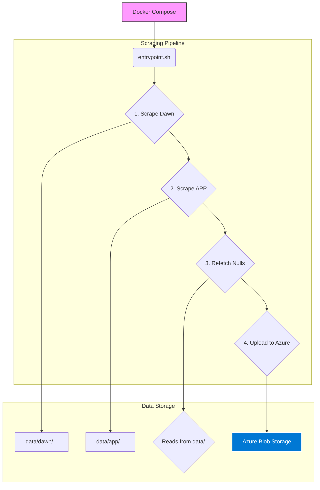

# Developer Notes

This document provides practical guidance for working on the XAI Articles Scraper project. It covers the Docker-based setup, coding conventions, script usage, and contribution practices.

Last updated: 2025-10-25

## 1. Getting Started

- **Requirements**: Docker Desktop, Node.js LTS, and pnpm.
- **Install Dependencies**: `pnpm install`
- **Environment**: Create a `.env` file for your `AZURE_STORAGE_KEY`.
- **Primary Workflow**: The entire pipeline is designed to be run via Docker Compose.

## 2. Repository Overview

- **Orchestration**: `entrypoint.sh` is the main script that runs the entire daily scraping pipeline. It is executed by the `scraper-daily` service in `docker-compose.yml`.
- **Scraper Scripts**: Core logic is in `scrape_*.js` files at the root.
- **Utility Scripts**: Helper scripts are located in `scripts/`.
- **Output Data**: Scraped data is saved to the `data/` directory, which is mounted as a volume in the Docker container.

## 3. Running Common Tasks

The primary way to run the scraper is through the `scraper-daily` Docker Compose service.

- **Run for the current day**:
  ```bash
  docker-compose run --rm scraper-daily
  ```

- **Run for a specific day**:
  ```bash
  docker-compose run --rm -e DATE=YYYY-MM-DD scraper-daily
  ```
  *Example*: `docker-compose run --rm -e DATE=2025-10-23 scraper-daily`

- **Debugging a single script**:
  You can execute a single script inside the container for debugging.
  ```bash
  docker-compose run --rm -e DATE=2025-10-23 scraper-daily node scripts/upload-to-azure.js
  ```

## 4. Conventions

- **Coding Style**: Modern Node.js with `async/await`.
- **Paths**: Use `path.join` for cross-platform compatibility.
- **Logging**: Use clear, prefixed log messages to indicate the source and step.
- **Error Handling**: The `entrypoint.sh` script uses `set -e`, so any failing command will stop the pipeline. Ensure scripts exit with a non-zero code on error.

## 5. Puppeteer Guidance

- **Configuration**: Puppeteer is configured to use the version of Chromium installed in the Docker image.
- **Headless by Default**: The scraper runs in headless mode.
- **Timeouts**: Scripts should implement sensible navigation and action timeouts to prevent hangs.

## 6. Environment Variables

- `DATE`: (Optional) Sets the target date for scraping. Defaults to the current date.
- `AZURE_STORAGE_KEY`: (Required) Your Azure Storage account key.
- `DOCKER_ENV=true`: Set automatically by the Docker environment.

## 7. Data Contracts

- See `documentation/requirements.md` for JSON schemas and data layout.
- Data is stored in `data/<source>/<type>/YYYY/MM/DD/`.

## 8. Contribution Workflow

- **Branching**: `feature/<short-desc>`, `fix/<short-desc>`.
- **Commits**: Use Conventional Commits style (`feat:`, `fix:`, `docs:`).
- **PRs**: When changing scraper logic, include sample output or logs.

## 9. Code Flow Diagram (Mermaid)

This diagram illustrates the high-level flow from the Docker entrypoint to the individual scraper scripts and final upload.

